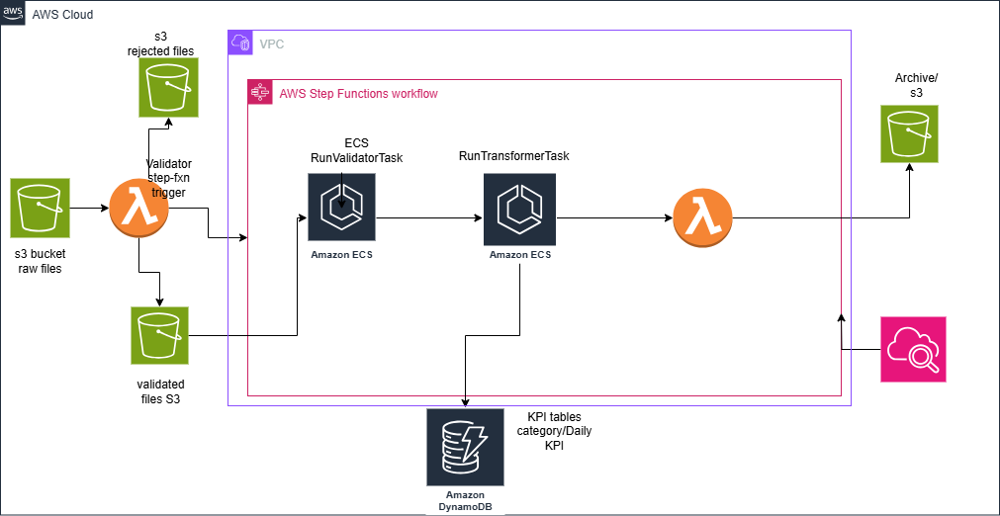
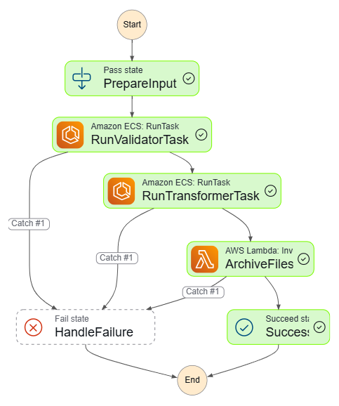

##  Project Overview

This project simulates a real-time data pipeline for an e-commerce company to compute order-level and category-level KPIs daily. It uses **AWS ECS**, **S3**, **Lambda**, **Step Functions**, and **DynamoDB**, orchestrated via **event-driven architecture** and **CI/CD with GitHub Actions**. The goal is to ingest raw CSV files from S3, validate them, transform them into business insights, and store the final KPIs in DynamoDB.



---

##  Problem Statement

* Every day, a set of 3 files (`orders`, `order_items`, `products`) is dropped into an S3 bucket under the `raw/` prefix.
* The system must ensure that **all 3 files** are present before triggering a processing pipeline.
* Files must be **validated** for schema and referential integrity.
* After validation, files are **transformed** to compute:

  * Daily revenue, return rate, and average order value per category.
  * Total orders, revenue, items sold, unique customers, and return rate per day.
* Results are saved into **two DynamoDB tables**: `order_kpis` and `category_kpis`.

---

##  Architecture + Flow (Step-by-Step Explanation)

```
   [S3 raw/]  -->  [Lambda (File Watcher)]
                      │
                      ├──> Validate headers/schema
                      ├──> Update DynamoDB ingestion registry
                      ├──> Move to validated/ if clean
                      ├──> Rejected folder + reason.json if invalid
                      └──> Trigger Step Function if 3 valid files are detected

   [Step Function] --> [ECS Validator Task] --> [ECS Transformer Task]
                                      │                  │
                                      ▼                  ▼
                            Refer. integrity         Compute KPIs
                            (products, orders)       Store in DynamoDB
                                                      (order_kpis & category_kpis)

                          --> [Lambda Archive Function] --> Move files to archived/
```

### Key Services Used

| Service            | Role                                                                   |
| ------------------ | ---------------------------------------------------------------------- |
| **S3**             | Stores incoming files (`raw/`, `validated/`, `rejected/`, `archived/`) |
| **Lambda**         | File validation, ingestion tracking, Step Function trigger, archiving  |
| **DynamoDB**       | Stores ingestion registry and final KPIs                               |
| **Step Functions** | Orchestrates ECS jobs + retries + error handling                       |
| **ECS Fargate**    | Runs containerized `validator` and `transformer` logic                 |
| **GitHub Actions** | Automates CI/CD to deploy Docker images to ECR and update ECS          |

---

##  Project Scope and Folder Structure

```
ecs-kpi-pipeline/
├── lambda/
│   ├── file_watcher.py
│   └── archive_lambda.py
├── ecs/
│   ├── validator.py
│   └── transformer.py
├── step_function/
│   └── pipeline1.json
├── .github/workflows/
│   └── deploy.yml
├── README_part1.md
├── README_part2.md
└── .env.template
```

---

##  DynamoDB Table Schemas

###  `ingestion_registry`

Tracks which files have arrived and when to trigger Step Functions.

```json
{
  "group_key": "part1",         // From filename suffix
  "orders_path": "validated/orders/orders_part1.csv",
  "order_items_path": "validated/order_items/order_items_part1.csv",
  "products_path": "validated/products/products.csv",
  "has_orders": true,
  "has_order_items": true,
  "order_date": "2025-07-07",
  "debounce_ttl": 1720000000     // UNIX timestamp for debounce expiration
}
```

###  `order_kpis`

```json
{
  "order_date": "2025-07-07",
  "total_orders": 43,
  "total_revenue": 13500.75,
  "total_items_sold": 221,
  "unique_customers": 38,
  "return_rate": 0.13
}
```

###  `category_kpis`

```json
{
  "order_date": "2025-07-07",
  "category": "electronics",
  "daily_revenue": 4800.25,
  "avg_order_value": 133.3,
  "avg_return_rate": 0.04
}
```

---

##  Project Setup & Deployment

### 1.  Clone the Repository

```bash
git clone https://github.com/yourusername/ecs-kpi-pipeline.git
cd ecs-kpi-pipeline
cp .env.template .env   # Fill in S3 bucket, ARNs, etc
```

### 2.  Build Docker Images

```bash
docker build -t validator:latest -f ecs/validator.Dockerfile ./ecs
docker build -t transformer:latest -f ecs/transformer.Dockerfile ./ecs
```

### 3.  Push to ECR via GitHub Actions

* GitHub Secrets Required: `AWS_ACCESS_KEY_ID`, `AWS_SECRET_ACCESS_KEY`, `AWS_REGION`, `ECR_REPO`
* Workflow: `.github/workflows/deploy.yml` will handle ECR push + ECS update

### 4.  Upload Input Files

Place raw CSVs into `s3://<bucket>/raw/`:

* `orders_part1.csv`
* `order_items_part1.csv`
* `products.csv`

Step Function will start automatically once all 3 validated versions exist.

---

##  IAM Role Permissions (Minimum Required)

### Lambda Execution Role:

```json
{
  "Effect": "Allow",
  "Action": [
    "s3:*",
    "dynamodb:*",
    "states:StartExecution"
  ],
  "Resource": "*"
}
```

### ECS Task Role:

```json
{
  "Effect": "Allow",
  "Action": ["s3:GetObject", "dynamodb:PutItem"],
  "Resource": "*"
}
```

---


##  Step Function Definition 



The Step Function orchestrates the pipeline using 3 main stages:

1. **RunValidatorTask**: Launches ECS validator container
2. **RunTransformerTask**: Launches ECS transformer container
3. **ArchiveFiles**: Lambda to archive validated data after processing

```json
{
  "Comment": "ECS batch validation and transformation pipeline",
  "StartAt": "RunValidatorTask",
  "States": {
    "RunValidatorTask": {
      "Type": "Task",
      "Resource": "arn:aws:states:::ecs:runTask.sync",
      "Parameters": {
        "LaunchType": "FARGATE",
        "Cluster": "ecs-data-pipeline1",
        "TaskDefinition": "validator-task",
        "NetworkConfiguration": {
          "AwsvpcConfiguration": {
            "AssignPublicIp": "ENABLED",
            "Subnets": ["subnet-xxx"],
            "SecurityGroups": ["sg-xxx"]
          }
        }
      },
      "ResultPath": "$.validator_result",
      "Retry": [{"ErrorEquals": ["States.ALL"], "IntervalSeconds": 10, "MaxAttempts": 2}],
      "Catch": [{"ErrorEquals": ["States.ALL"], "Next": "HandleFailure"}],
      "Next": "RunTransformerTask"
    },
    "RunTransformerTask": {
      "Type": "Task",
      "Resource": "arn:aws:states:::ecs:runTask.sync",
      "Parameters": {
        "LaunchType": "FARGATE",
        "Cluster": "ecs-data-pipeline1",
        "TaskDefinition": "transformer-task",
        "NetworkConfiguration": {
          "AwsvpcConfiguration": {
            "AssignPublicIp": "ENABLED",
            "Subnets": ["subnet-xxx"],
            "SecurityGroups": ["sg-xxx"]
          }
        }
      },
      "ResultPath": "$.transformer_result",
      "Retry": [{"ErrorEquals": ["States.ALL"], "IntervalSeconds": 10, "MaxAttempts": 2}],
      "Catch": [{"ErrorEquals": ["States.ALL"], "Next": "HandleFailure"}],
      "Next": "ArchiveFiles"
    },
    "ArchiveFiles": {
      "Type": "Task",
      "Resource": "arn:aws:lambda:<region>:<account>:function:ecs-archive-validated-files",
      "Parameters": {
        "Payload": {
          "group_key.$": "$.group_key",
          "order_date.$": "$.order_date",
          "orders_path.$": "$.orders_path",
          "order_items_path.$": "$.order_items_path",
          "products_path.$": "$.products_path"
        }
      },
      "Retry": [{"ErrorEquals": ["States.ALL"], "IntervalSeconds": 5, "MaxAttempts": 2}],
      "Catch": [{"ErrorEquals": ["States.ALL"], "Next": "HandleFailure"}],
      "Next": "Success"
    },
    "HandleFailure": { "Type": "Fail", "Error": "StepFailed", "Cause": "Task failed" },
    "Success": { "Type": "Succeed" }
  }
}
```

---

##  Lambda Functions

### 1. File Watcher Lambda (Validation + Trigger)

* Triggered by S3 event
* Validates headers
* Copies valid files to `validated/`
* Updates `ingestion_registry` table
* When both `orders` and `order_items` exist and `products` is available, triggers Step Function

### 2. Archive Lambda (ecs-archive-validated-files)

* Triggered after transformation
* Moves validated files to `archived/` with date and group key
* Keeps storage clean and supports lineage tracking

---

##  ECS Containers

### Validator Container

* Downloads files from `validated/`
* Performs referential and schema checks (order-item link, etc.)
* Fails if inconsistencies found

### Transformer Container

* Loads cleaned data from S3
* Joins and calculates:

  * `order_kpis`: revenue, return rate, items sold
  * `category_kpis`: per category KPIs
* Inserts results into DynamoDB tables

---

##  Simulation Guide

To simulate real-time ingestion:

1. Upload files to S3 → `raw/`
2. Lambda validates → moves to `validated/`
3. Registry updated
4. Once both order files and products are ready → Step Function is triggered

### Test Scenarios

* Upload `orders` only → nothing runs
* Upload `order_items` after `orders` → pipeline triggers
* Re-upload any file → new pipeline triggered with new group\_key

---

##  DynamoDB Schema

### ingestion\_registry

```json
{
  "group_key": "part1",
  "orders_path": "validated/orders/orders_part1.csv",
  "order_items_path": "validated/order_items/order_items_part1.csv",
  "products_path": "validated/products/products.csv",
  "has_orders": true,
  "has_order_items": true,
  "order_date": "2023-08-01"
}
```

### order\_kpis

* Partition Key: `order_date`

### category\_kpis

* Partition Key: `category`
* Sort Key: `order_date`

---

##  IAM Role Summary

### Lambda Execution Roles

* Read/write to S3
* Access DynamoDB (put\_item, update\_item)
* Start Step Function execution

### ECS Task Roles

* Read-only access to S3
* PutItem access to DynamoDB tables

### Step Function Role

* Invoke ECS and Lambda

---

##  CI/CD with GitHub Actions

* Dockerfiles for validator and transformer
* GitHub workflow builds and pushes image to ECR:

  ```yaml
  - name: Build & Push
    run: |
      docker build -t validator .
      docker tag validator:latest <ecr-uri>/validator
      docker push <ecr-uri>/validator
  ```
* ECS service auto-pulls latest image on deploy

---

##  Future Enhancements

* Add Slack/Email alerts on failures
* Add Glue job to archive raw/rejected data to Athena-parquet layer
* Add partitioning by `order_date` in DynamoDB or S3
* Store logs in CloudWatch Logs Insights with query support
* S3 object versioning for data lineage
* Add API Gateway + Lambda for real-time KPI fetching

---


